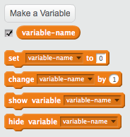

+ স্ক্রিপ্ট ট্যাবের **Data** -তে ক্লিক করুন, এরপর **Make a Variable** -এ ক্লিক করুন।
    
    

+ আপনার ভেরিয়েবলের নাম দিন। ভেরিয়েবলটি সব স্প্রাইটের জন্য কার্যকরী হবে অথবা শুধু এই একটি স্প্রাইটের জন্য কার্যকরী হবে তা নির্ধারন করতে পারেন। **OK** বাটনে ক্লিক করুন।
    
    

+ ভেরিয়েবল তৈরি করার পর তা স্টেজে দেখা যাবে, অথবা আপনি স্ক্রিপ্ট ট্যাবে টিক দিয়ে একে সরিয়ে রাখতে পারেন যেন স্টেজে দেখা না যায়।
    
    

+ নতুন ব্লক প্রদর্শিত হবে এবং এখান থেকে ভেরিয়েবলের মান পরিবর্তন করতে পারবেন।
    
    