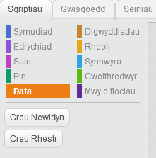
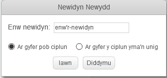
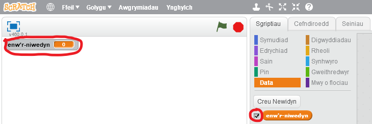

+ Cliciwch ar **Data** yn y tab Sgriptiau, yna cliciwch ar **Gwneud Amrywiad**.
    
    

+ Teipiwch enw eich newidyn. Gallwch ddewis p'un a hoffech i'ch newidyn fod ar gael i bob sprites, neu at y ffynhonnell hon yn unig. Gwasgwch **OK**.
    
    

+ Unwaith y byddwch wedi creu'r newidyn, bydd yn cael ei arddangos ar y Cyfnod, neu gallwch ddatgymalu'r newidyn yn y tab Sgriptiau i'w guddio.
    
    

+ Bydd blociau newydd yn ymddangos ac yn caniatáu ichi newid gwerth y newidyn.
    
    