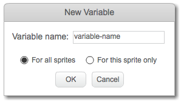

+ Klik på **Data** i fanen Scripts, og klik derefter på **Lav en variabel**.
    
    

+ Indtast navnet på din variabel. Du kan vælge, om du vil have din variabel tilgængelig for alle sprites eller kun denne sprite. Tryk på **OK**.
    
    

+ Når du har oprettet variablen, vises den på scenen, eller du kan afmarkere variablen på fanen Scripts for at skjule den.
    
    

+ Nye blokke vises og giver dig mulighed for at ændre værdien af ​​variablen.
    
    