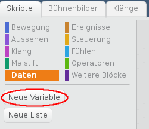
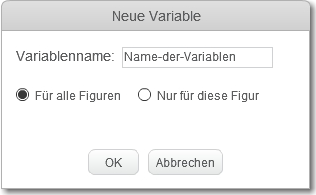
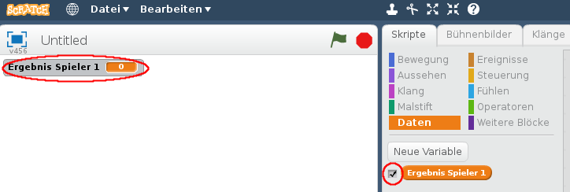
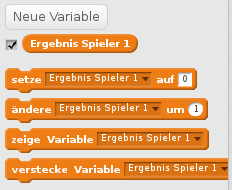

+ Klicke auf **Daten** in der Registerkarte Skripte, klicke dann auf **Neue Variable**.
    
    

+ Gib den Namen deiner Variablen ein. Du kannst auswählen, ob deine Variable für alle Figuren, oder nur für die ausgewählte Figur verfügbar sein soll. Klicke auf **OK**.
    
    

+ Nachdem du die Variable erstellt hast, wird sie auf der Bühne angezeigt, oder sie wird versteckt, wenn du das Häkchen vor der Variablen in der Registerkarte Skripte entfernst.
    
    

+ Neue Blöcke erscheinen und erlauben dir, den Wert der Variablen zu ändern.
    
    