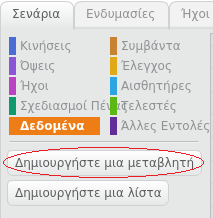
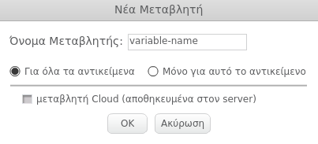
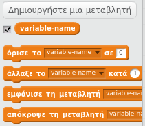

+ Κάνε κλικ στο **Δεδομένα** στην καρτέλα Σενάρια και, στη συνέχεια, κάνε κλικ στο **Δημιουργήστε μία μεταβλητή**.
    
    

+ Πληκτρολόγησε το όνομα της μεταβλητής. Μπορείς να επιλέξεις αν θες η μεταβλητή να είναι διαθέσιμη σε όλα τα αντικείμενα ή μόνο στο συγκεκριμένο. Πάτησε **OK**.
    
    

+ Μόλις δημιουργήσεις τη μεταβλητή, θα εμφανιστεί στο Σκηνικό. Μπορείς να αποεπιλέξεις τη μεταβλητή στην καρτέλα Σενάρια για να την αποκρύψεις.
    
    

+ Θα εμφανιστούν νέα μπλοκ επιτρέποντας την αλλαγή της τιμής της μεταβλητής.
    
    