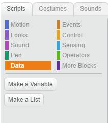
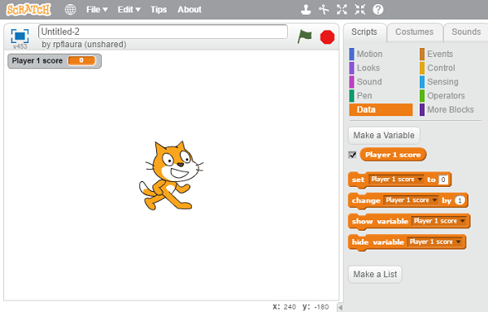

+ Click on "Data" in the Scripts tab, then click on "Make a Variable"

  

+ Type in the name of your variable. You can choose whether you would like your variable to be available to all sprites, or to only this sprite. Press OK.

  

+ Once you have created the variable, it will be displayed on the stage, or you can untick the variable in the Scripts tab to hide it.

  

+ New blocks will appear and allow you to change the value of the variable.

  
