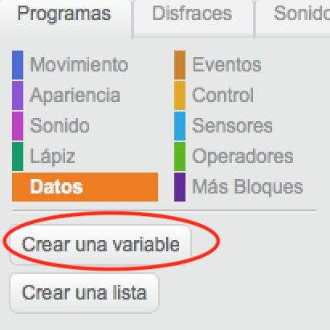
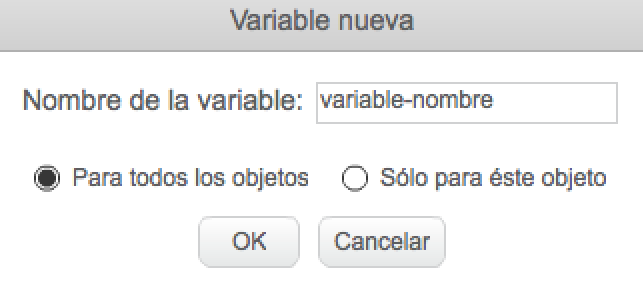
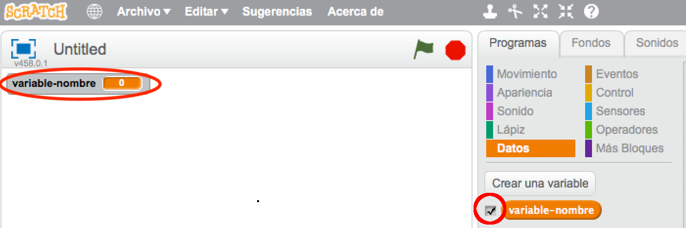
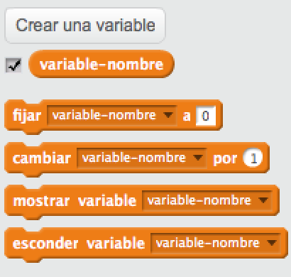

+ Haz clic en **Datos** en la pestaña Scripts, después haz clic en **Crear una Variable**.
    
    

+ Escribe el nombre de tu variable. Puedes elegir si deseas que tu variable esté disponible para todos los sprites o solo para este sprite. Presiona **OK**.
    
    

+ Cuando hayas creado la variable se mostrará en el escenario, o puedes desmarcar la variable en la pestaña de Scripts para ocultarla.
    
    

+ Aparecerán nuevos bloques y te permitirán cambiar el valor de la variable.
    
    