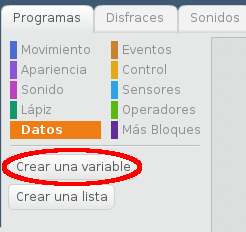
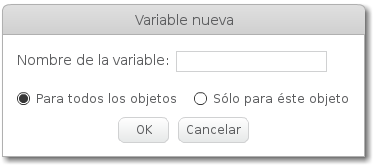
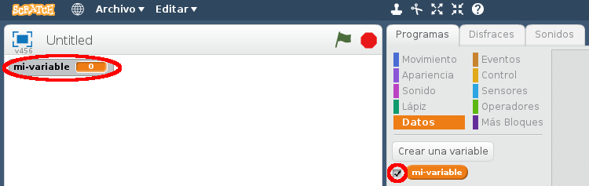
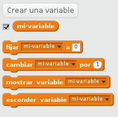

+ Click en **Datos** en la pestaña Programas, luego click en **Crear una Variable**.
    
    

+ Escribe el nombre de tu variable. Puedes escoger si te gustaría que tu variable esté disponible para todos los objetos, o sólo para este objeto. Presiona **OK**.
    
    

+ Una vez creada la variable se mostrará en el escenario, o puedes desmarcar la variable en la pestaña Programas para ocultarla.
    
    

+ New blocks will appear and allow you to change the value of the variable.
    
    