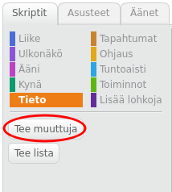
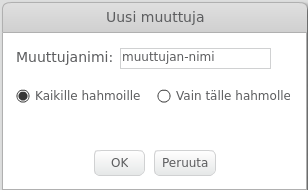
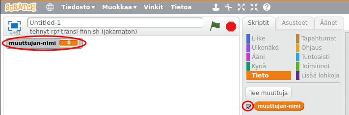
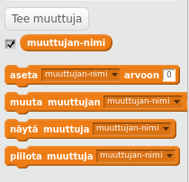

+ Napsauta Scripts-välilehdellä **Data** ja napsauta **Muuta muuttuja**.
    
    

+ Kirjoita muuttujan nimi. Voit valita, haluatko muuttujasi olevan kaikkien spritsien käytettävissä tai vain tämä sprite. Paina **OK**.
    
    

+ Kun olet luonut muuttujan, se näkyy vaiheessa tai voit purkaa muuttujan Scripts-välilehdellä piilottaaksesi sen.
    
    

+ Uudet lohkot tulevat näkyviin ja voit muuttaa muuttujan arvoa.
    
    