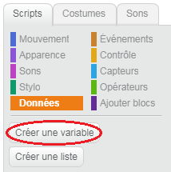
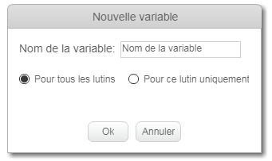
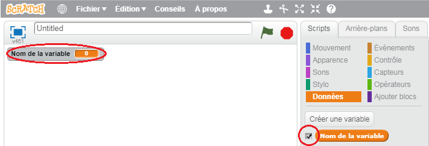
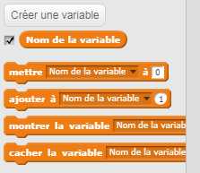

+ Cliquez sur **Données** dans l'onglet Scripts, cliquez sur **Créer une variable**.
    
    

+ Tapez le nom de votre variable. Vous pouvez choisir si vous souhaitez que votre variable soit disponible pour tous les lutins, ou uniquement pour ce lutin. Appuyez sur **Ok**.
    
    

+ Une fois que vous avez créé la variable, elle s'affiche sur la scène, ou vous pouvez la décocher dans l'onglet Scripts pour la masquer.
    
    

+ De nouveaux blocs apparaîtront et vous permettront de changer la valeur de la variable.
    
    