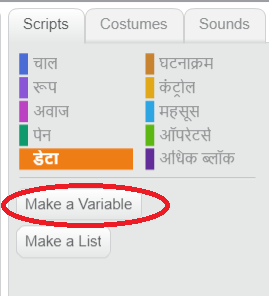
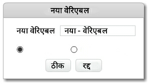
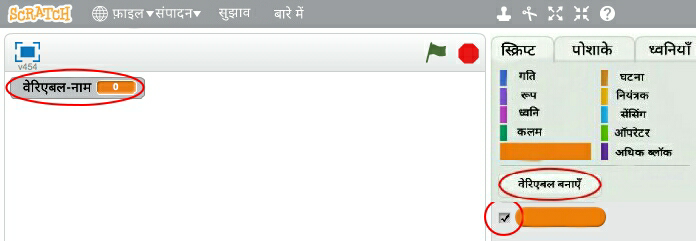
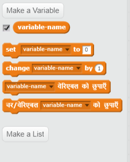

+ Scripts टैब में **"डेटा"** पर क्लिक करें, उसके बाद **"वेरिएबल बनाएँ"** पर क्लिक करें।
    
    

+ अपने वेरिएबल का नाम टाइप करें। आप यह चयन कर सकते हैं कि आपका वेरिएबल सभी स्प्राइट्स के लिए उपलब्ध हो या केवल इसी स्प्राइट के लिए उपलब्ध हो **ठीक** दबाएँ।
    
    

+ एक बार जब आप वेरिएबल बना लेते है, यह स्टेज पर दिखाई देगा, या आप इसे छिपाने के लिए स्क्रिप्ट टैब में वेरिएबल को टिक हटा सकते हैं।
    
    

+ नए ब्लॉक्स दिखाई देंगे और वे आपको वेरिएबल का मान बदलने की सुविधा प्रदान करेंगे।
    
    