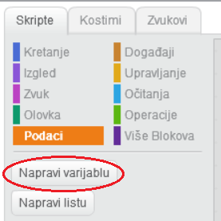
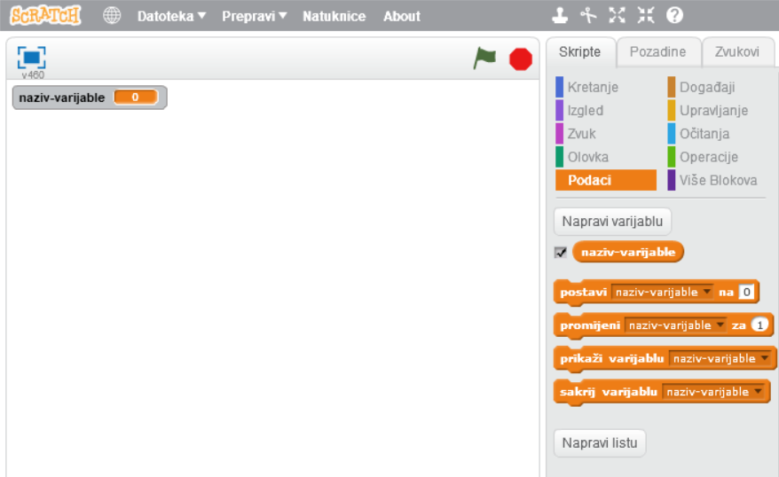
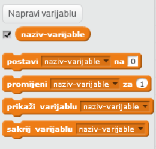

+ Kliknite na **Podaci** na kartici Skripta, a zatim kliknite na **Napravite varijablu**.
    
    

+ Unesite naziv svoje varijable. Možete odabrati želite li da varijabla bude dostupna svim spritesima ili samo tom spriteu. Pritisnite **OK**.
    
    

+ Nakon što stvorite varijablu, ona će biti prikazana na Stage ili možete odstraniti varijablu na kartici Skripte da biste je sakrili.
    
    

+ Prikazat će se novi blokovi i dopustiti vam da promijenite vrijednost varijable.
    
    