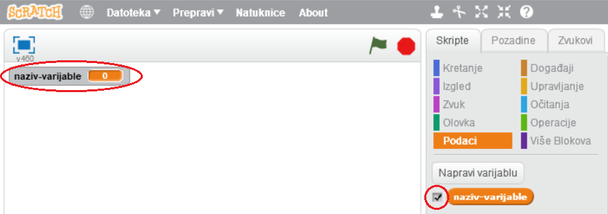

+ Kliknite na **Podaci** na kartici Skripte, a zatim na **Napravi varijablu**.
    
    

+ Unesi naziv varijable. Možeš odabrati želiš li da varijabla bude dostupna svim likovima ili samo ovom liku. Pritisni **OK**.
    
    

+ Nakon što napraviš varijablu, bit će prikazana na Pozornici. Možeš maknuti kvačicu kraj varijable na kartici Skripte da bi ju sakrio.
    
    

+ Prikazat će se novi blokovi pomoću kojih možeš promijeniti vrijednost varijable.
    
    