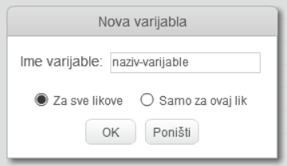

+ Kliknite na **Podaci** na kartici Skripte, a zatim kliknite na **Napravi varijablu**.
    
    

+ Unesi naziv varijable. Možeš odabrati želiš li da varijabla bude dostupna svim likovima ili samo ovom liku. Pritisni **OK**.
    
    

+ Nakon što stvoriš varijablu, bit će prikazana na pozornici. Možeš maknuti kvačicu kraj varijable na kartici Skripte da bi je sakrio.
    
    

+ Prikazat će se novi blokovi i dopustiti ti da promijeniš vrijednost varijable.
    
    