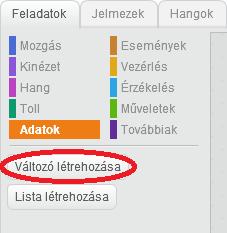
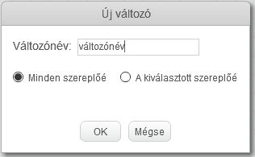
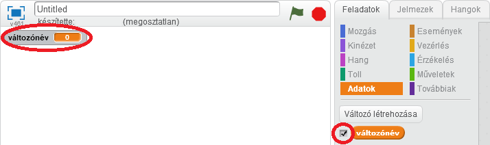
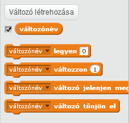

+ A Feladatok fülön kattints az **Adatok** elemre, majd kattints a **Változó létrehozása** gombra.
    
    

+ Írd be a változó nevét. Kiválaszthatod, hogy a változó elérhető legyen-e minden szereplőnél, vagy csak ennél a szereplőnél. Nyomd meg az **OK** gombot.
    
    

+ Miután létrehoztad a változót, megjelenik a játéktéren, de el is rejtheted a változót a Feladatok fülön a jelölőnégyzettel.
    
    

+ Új blokkok jelennek meg, amelyekkel megváltoztathatod a változó értékét.
    
    