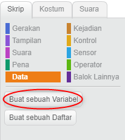
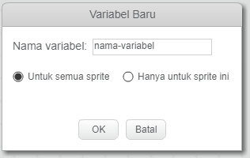
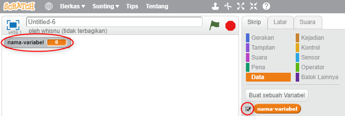
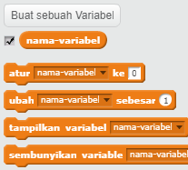

+ Klik **Data** pada tab Skrip, lalu klik **Buat sebuah Variabel**.
    
    

+ Ketik nama variabel Kamu. Kamu dapat memilih apakah Kamu ingin variabel Kamu tersedia untuk semua sprite, atau hanya sprite ini saja. Tekan **OK**.
    
    

+ Setelah Kamu membuat variabel, variabel tersebut akan ditampilkan di Stage, atau Kamu dapat menghapus centang variabel di tab Skrip untuk menyembunyikannya.
    
    

+ Blok baru akan muncul dan memungkinkan Kamu untuk mengubah nilai variabel.
    
    