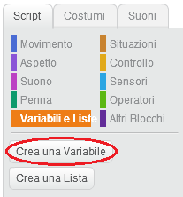
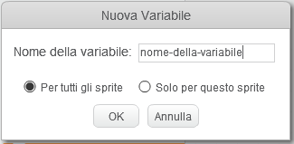
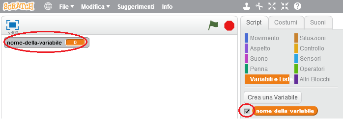
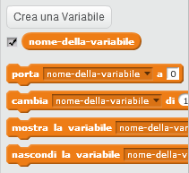

+ Nella scheda Script, clicca su **Variabili e Liste**, poi clicca su **Crea una Variabile**.
    
    

+ Scrivi il nome della tua variabile. Puoi scegliere se rendere la tua variabile disponibile per tutti gli sprite o solo per questo sprite. Clicca **OK**.
    
    

+ Una volta creata la variabile, questa verrà visualizzata sullo sfondo. Puoi nascondere la variabile deselezionandola nella scheda Script.
    
    

+ Appariranno nuovi blocchi che ti permetteranno di cambiare il valore della tua variabile.
    
    