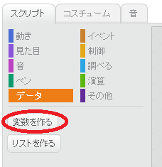
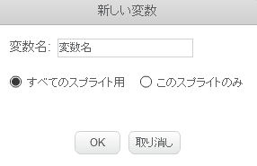
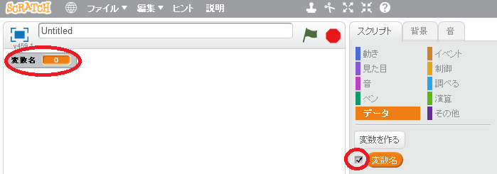
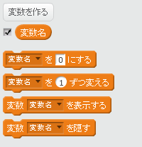

+ [スクリプト]タブで **データ** をクリックし、 **変数を作る** をクリックします。
    
    

+ 変数の名前を入力します。全てのスプライトが変数を使用するか、このスプライトのみかを選択できます。 **OK** を押します。
    
    

+ 変数の作成後、その変数がステージに表示されますが、[スクリプト]タブで変数の設定を解除すると隠すことができます。
    
    

+ 新しいブロックが表示され、変数の値を変更できます。
    
    