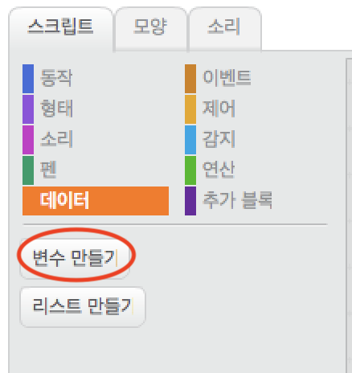
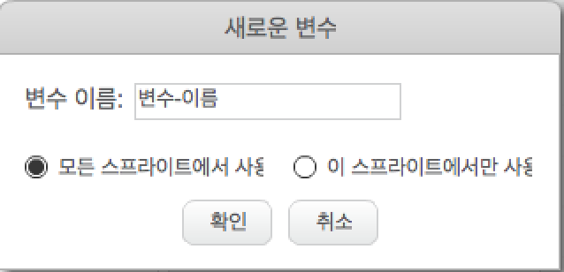
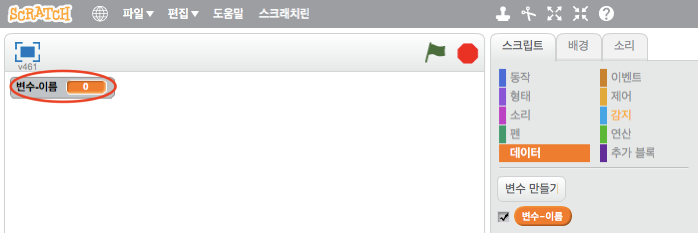
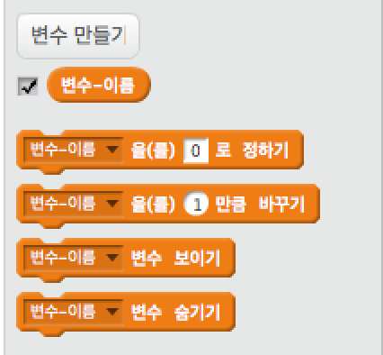

+ 스크립트 탭에서 **데이터** 를 클릭 한 다음 **변수 만들기**를 클릭하십시오.
    
    

+ 변수의 이름을 입력하십시오. 변수를 모든 스프라이트에 사용 할지, 또는 이 스프라이트에만 적용해야 할지를 선택할 수 있습니다. **OK**을 누르세요.
    
    

+ 변수를 만든 후에는 스테이지에 변수가 표시되고, 혹은 스크립트 탭에서 해당 변수의 표시를 지워서 숨길 수 있습니다.
    
    

+ 새로운 블록이 나타나고 변수의 값을 변경할 수 있습니다.
    
    