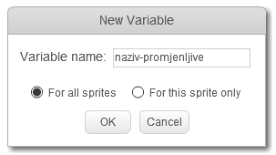
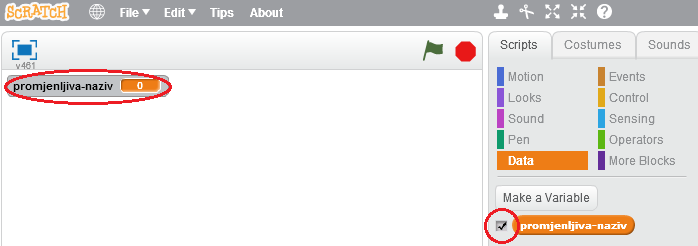
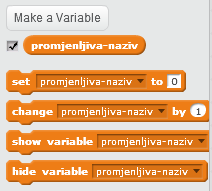

+ Klikni na **Data** (Podaci) na kartici Scripts (Skripte), a zatim klikni na **Make a Variable** (Napravi promjenljivu).
    
    

+ Upiši naziv svoje promjenljive. Možeš da izabereš da li želiš da tvoja promjenljiva bude dostupna svim likovima ili samo ovom liku. Pritisni **OK**.
    
    

+ Kada napraviš promjenljivu, biće prikazana na Pozornici. Možeš da sakriješ promjenljivu tako što ćeš maći kvačicu pored promjenljive na kartici Scripts.
    
    

+ Pojaviće se novi blokovi koji će ti omogućiti da mijenjaš vrijednost promjenljive.
    
    