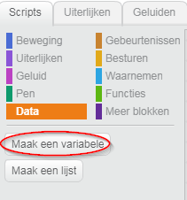
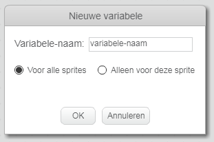
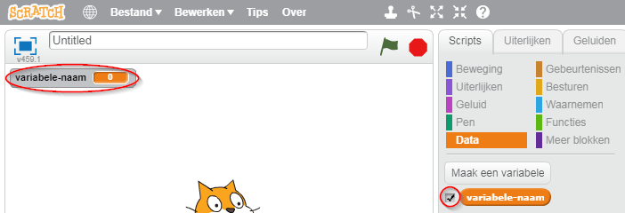
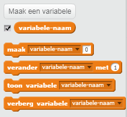

+ Klik op **Data** in het tabblad Scripts en klik vervolgens op **Maak een variabele**.
    
    

+ Typ de naam van je variabele in. Je kunt kiezen of je wilt dat jouw variabele voor alle sprites beschikbaar is, of alleen voor deze sprite. Druk op **OK**.
    
    

+ Nadat je de variabele hebt gemaakt, wordt die in het werkgebied weergegeven, maar je kunt de variabele in het tabblad Scripts ook uitvinken om hem te verbergen.
    
    

+ Er verschijnen nieuwe blokken waarmee je de waarde van de variabele kunt wijzigen.
    
    