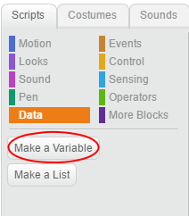

+ Klikk på **Data** i Skript-kategorien, og klikk deretter på **Gjør en variabel**.
    
    

+ Skriv inn navnet på variabelen din. Du kan velge om du vil at variabelen skal være tilgjengelig for alle sprites, eller til bare denne sprite. Trykk **OK**.
    
    

+ Når du har opprettet variabelen, vil den bli vist på scenen, eller du kan slå av variabelen på Skript-fanen for å skjule den.
    
    

+ Nye blokker vises og lar deg endre verdien av variabelen.
    
    