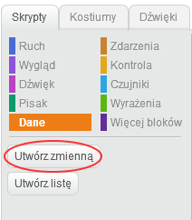
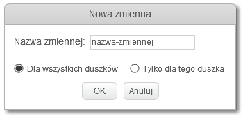
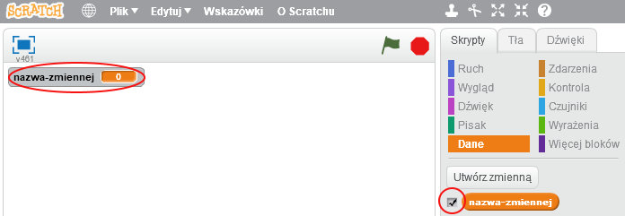
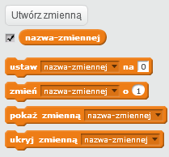

+ Kliknij **Dane** na karcie Skrypty, a następnie kliknij **Utwórz zmienną**.
    
    

+ Wpisz nazwę swojej zmiennej. Możesz wybrać, czy chcesz, aby zmienna była dostępna dla wszystkich duszków, czy tylko dla tego duszka. Naciśnij **OK**.
    
    

+ Po utworzeniu zmiennej zostanie ona wyświetlona na stole montażowym lub można ją odznaczać na karcie Skrypty, aby ją ukryć.
    
    

+ Pojawią się nowe bloki i pozwoli zmienić wartość zmiennej.
    
    