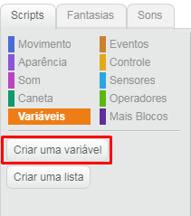
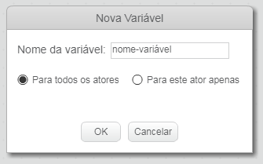
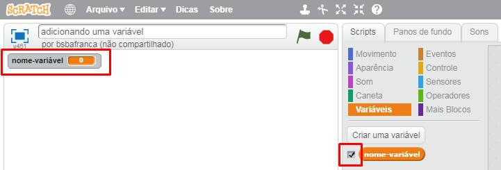
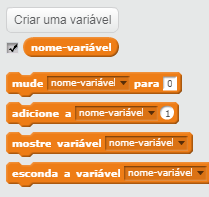

+ Clique em **Variáveis** na aba Scripts e, em seguida, clique em **. Criar uma variável**.
    
    

+ Digite o nome da sua variável. Você pode escolher se deseja que sua variável esteja disponível para todos os atores ou apenas este ator. Pressione **OK**.
    
    

+ Depois de criar a variável, ela será exibida no Palco, ou você pode desmarcar a variável na aba Scripts para ocultá-la.
    
    

+ Novos blocos aparecerão e permitirão que você altere o valor da variável.
    
    