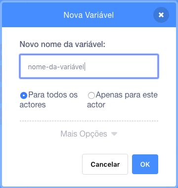
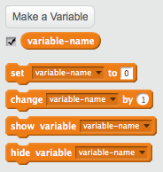

+ Click on **Data** in the Scripts tab, then click on **Make a Variable**.
    
    

+ Escreve o nome da tua variável. Podes escolher se queres que tua variável esteja disponível para todos os Actores ou apenas para este Actor. Clica **OK**.
    
    

+ Depois de criares a variável, ela vai ficar visível no Palco, ou podes desselecionar a variável no menu "Scripts" para a ocultares.
    
    

+ New blocks will appear and allow you to change the value of the variable.
    
    