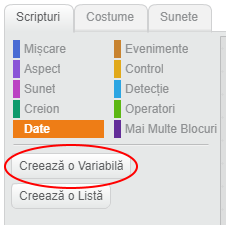
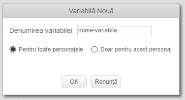
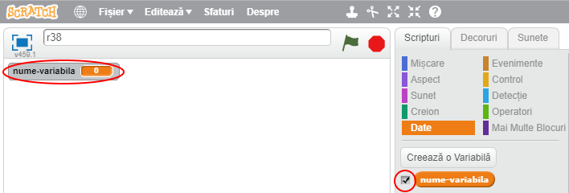
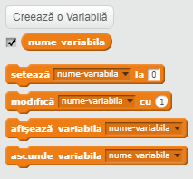

+ Faceți clic pe **Data** din fila Scripturi, apoi faceți clic pe **Faceți o variabilă**.
    
    

+ Introduceți numele variabilei dvs. Puteți alege dacă doriți ca variabila dvs. să fie disponibilă pentru toate spritele sau doar pentru această sprite. Apăsați **OK**.
    
    

+ Odată ce ați creat variabila, aceasta va fi afișată pe Etapă sau puteți decupla variabila din fila Scripts pentru a o ascunde.
    
    

+ Vor apărea blocuri noi și vă vor permite să modificați valoarea variabilei.
    
    