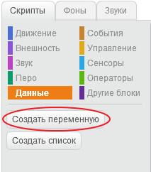
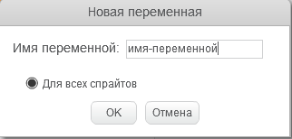
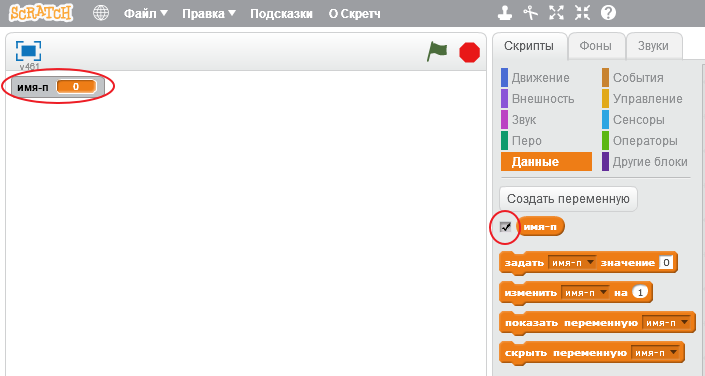
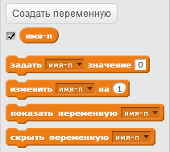

+ Нажмите на **Данные** на вкладке Сценарии, затем нажмите **Сделайте Переменный**.
    
    

+ Введите имя переменной. Вы можете выбрать, хотите ли вы, чтобы ваша переменная была доступна для всех спрайтов или только для этого спрайта. Нажмите **OK**.
    
    

+ После того, как вы создали переменную, она будет отображаться в рабочей области, или вы можете отключить эту переменную на вкладке «Сценарии», чтобы скрыть ее.
    
    

+ Появятся новые блоки и вы сможете изменить значение переменной.
    
    