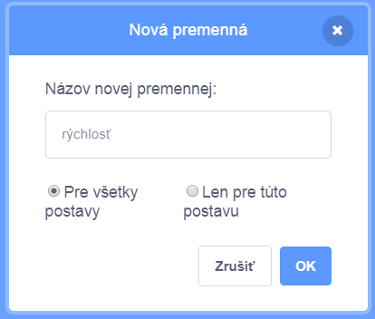
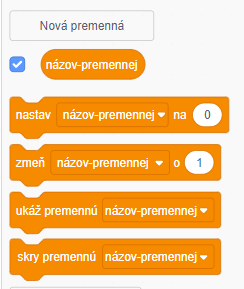

+ Kliknite na **Údaj** na karte Skripty a potom kliknite na **Vytvoriť premennú**.
    
    

+ Zadajte názov premennej. Môžete si vybrať, či chcete, aby bola vaša premenná k dispozícii všetkým štetcom, alebo len tejto skriptke. Stlačte **OK**.
    
    

+ Akonáhle vytvoríte premennú, zobrazí sa v Stage, alebo ju môžete odstrániť na karte Skripty, aby ste ju skryli.
    
    

+ Zobrazia sa nové bloky a umožnia vám zmeniť hodnotu premennej.
    
    