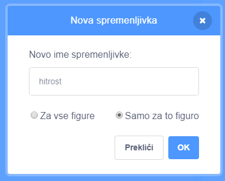
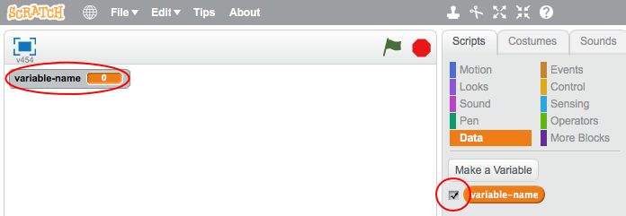
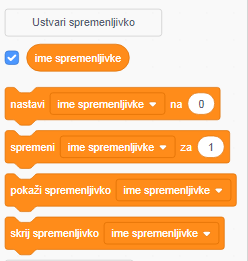

+ Na kartici Skripti kliknite **Podatki** in nato kliknite **Make Variable**.
    
    

+ Vnesite ime svoje spremenljivke. Izberete lahko, ali želite, da je vaša spremenljivka na voljo za vse sprite ali samo za ta sprite. Pritisnite **OK**.
    
    

+ Ko ustvarite spremenljivko, se bo prikazala na odru, ali pa jo lahko odklenete na kartici Skripti, da jo skrijete.
    
    

+ Pojavi se novi bloki in vam omogočajo, da spremenite vrednost spremenljivke.
    
    