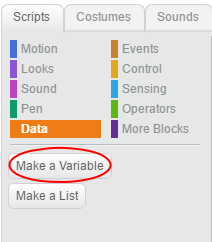

+ Klicka på **Data** på fliken Skript och klicka sedan på **Gör en variabel**.
    
    

+ Skriv in namnet på din variabel. Du kan välja om du vill att din variabel ska vara tillgänglig för alla sprites, eller till bara denna sprite. Tryck på **OK**.
    
    

+ När du har skapat variabeln kommer den att visas på scenen, eller du kan avmarkera variabeln på fliken Skript för att dölja den.
    
    

+ Nya block visas och låter dig ändra värdet på variabeln.
    
    