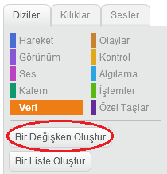
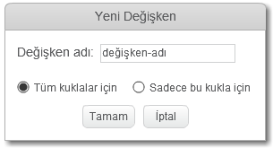
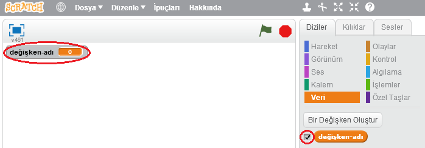
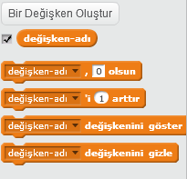

+ Diziler sekmesindeki **Veri**'nin üzerine, ardından **Bir Değişken Oluştur** seçeneğine tıklayın.
    
    

+ Değişkeninizin adını yazın. Değişkeninizin tüm kuklalar için mi yoksa sadece bu kukla için mi olacağını seçebilirsiniz. **Tamam** tuşuna basın.
    
    

+ Değişkeni oluşturduktan sonra, Sahne'de gözükecektir. Gizlemek için Diziler sekmesinde değişkenin yan tarafındaki tiki kaldırabilirsiniz.
    
    

+ Yeni bloklar ortaya çıkacak ve değişkenin değerini değiştirmenize izin verecektir.
    
    