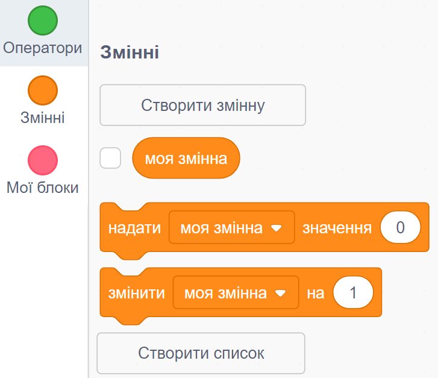
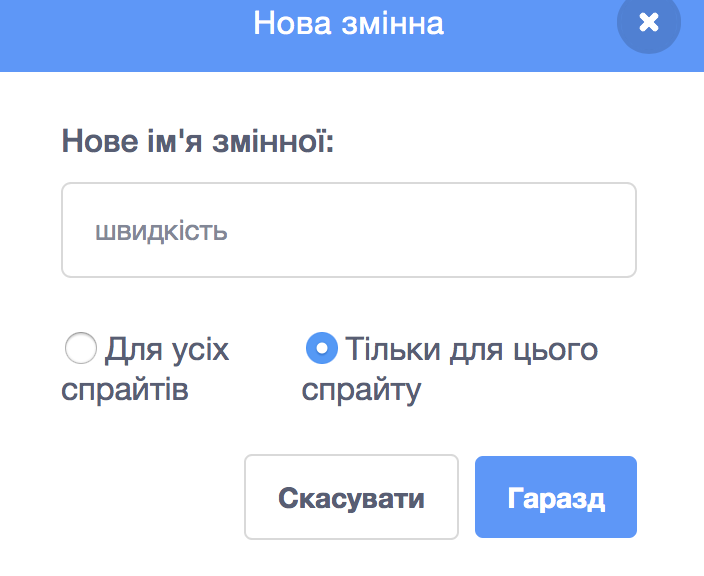
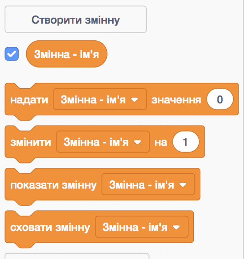

+ Click on **Data** in the Scripts tab, then click on **Make a Variable**.
    
    

+ Введіть ім'я вашої змінної. Ви маєте вибір: ваша змінна може бути доступною для всіх спрайтів, або тільки для цього конкретного спрайту. Натисніть **Гаразд**.
    
    

+ Після того, як ви створили змінну, вона буде показана на вкладці "Сцена", або ви зможете зняти галочку зі змінної на вкладці "Скрипти", щоб сховати її.
    
    

+ New blocks will appear and allow you to change the value of the variable.
    
    